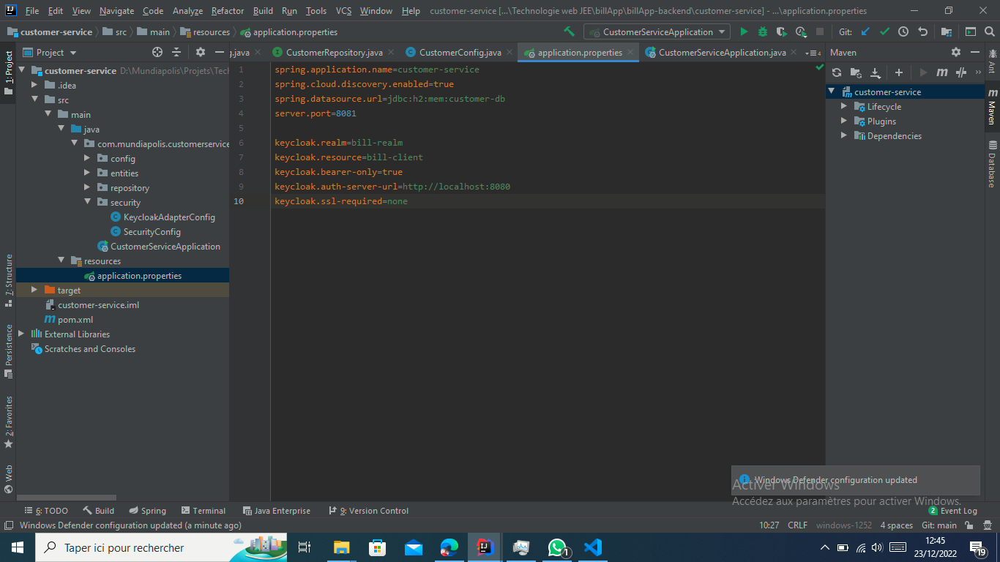
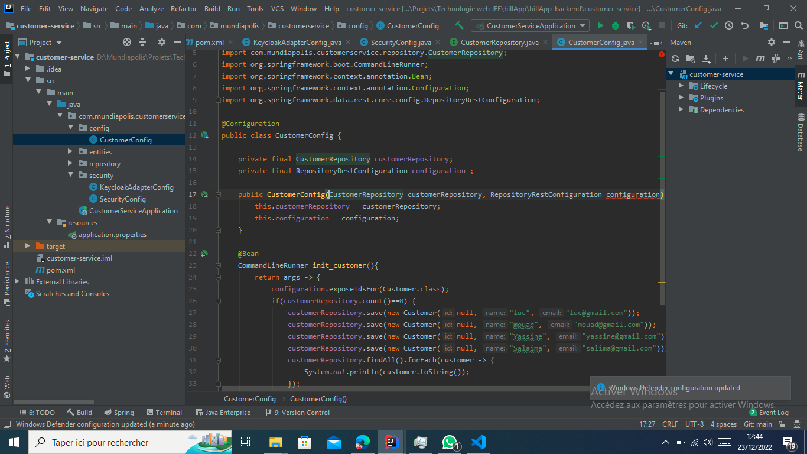
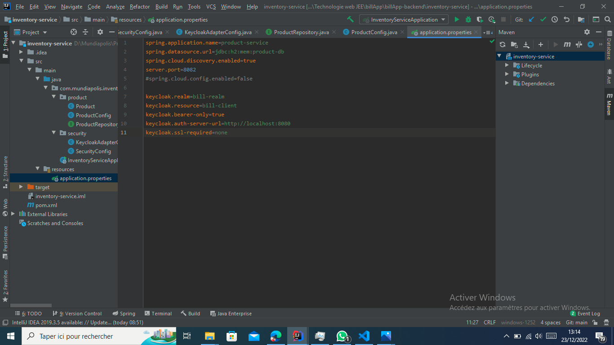
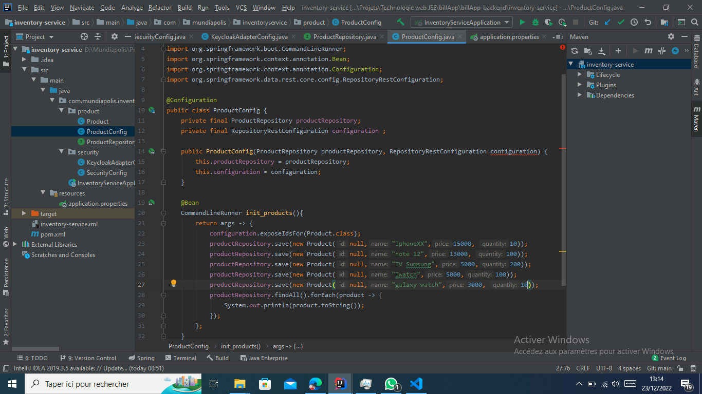
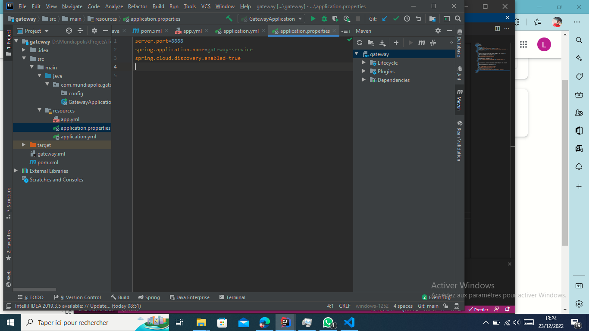
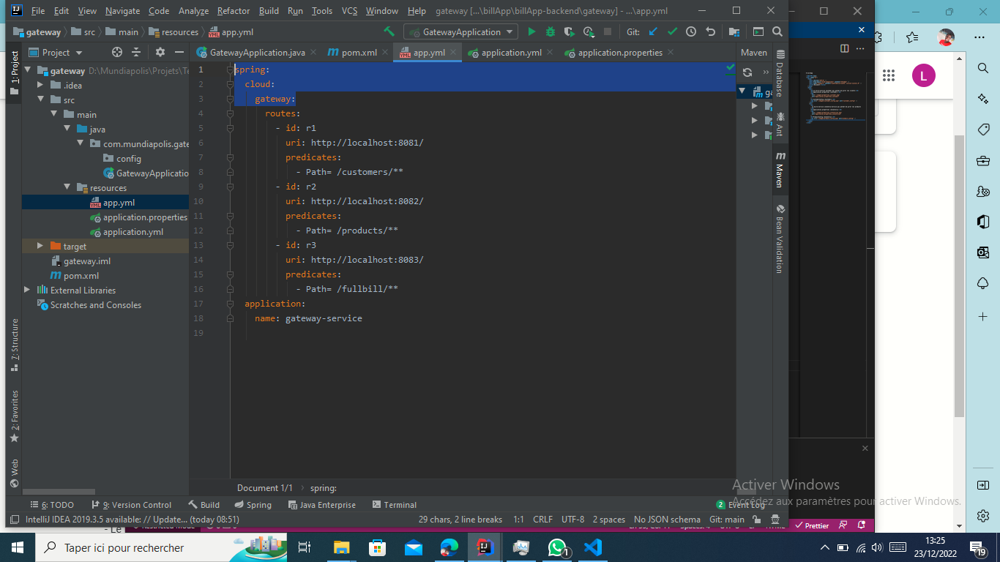
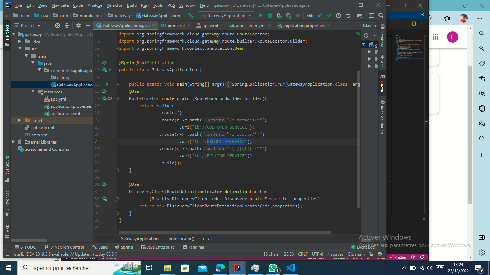

# billApp

<!DOCTYPE html>
<html lang="en">
  <head>
    <meta charset="UTF-8" />
    <meta http-equiv="X-UA-Compatible" content="IE=edge" />
    <meta name="viewport" content="width=device-width, initial-scale=1.0" />
    <title>Document</title>
  </head>
  <body>
    

      <h4>Le micro-service Customer qui permet de gérer les clients</h4>
      <h5>application.properties (Customer)</h5>
      
      <h5>CustomerConfig (Customer)</h5>
      
    

    

      <h5>
        Le micro-service inventory-service qui permet de gérer les produits
      </h5>
      <h6>application.properties (Inventory)</h6>
      
      <h6>ProductConfig (Inventory)</h6>
      
    

    

      <h5>La Gateway Spring cloud Gateway</h5>
      <h6>application.properties (Gateway)</h6>
      
    

    

      <h5>Configuration statique du système de Routage</h5>
      <h6>application.yml (Gateway)</h6>
      
    

    

      <h5>Configuration dynamique du système de Routage</h5>
      <h6>GatewayApplication.java (Gateway)</h6>
      
    

  </body>
</html>
