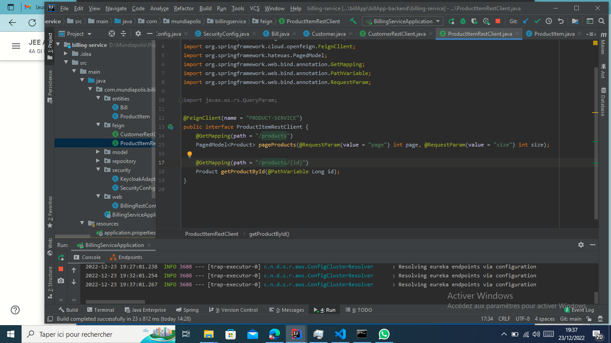

# billApp

<!DOCTYPE html>
<html lang="en">
  <head>
    <meta charset="UTF-8" />
    <meta http-equiv="X-UA-Compatible" content="IE=edge" />
    <meta name="viewport" content="width=device-width, initial-scale=1.0" />
    <title>Document</title>
  </head>
  <body>
    

      <h4>Le micro-service Customer qui permet de gérer les clients</h4>
      <h5>application.properties (Customer)</h5>
      
      <h5>CustomerConfig (Customer)</h5>
      
    

    

      <h5>
        Le micro-service inventory-service qui permet de gérer les produits
      </h5>
      <h6>application.properties (Inventory)</h6>
      
      <h6>ProductConfig (Inventory)</h6>
      
    

    

      <h5>La Gateway Spring cloud Gateway</h5>
      <h6>application.properties (Gateway)</h6>
      
    

    

      <h5>Configuration statique du système de Routage</h5>
      <h6>application.yml (Gateway)</h6>
      
    

    

      <h5>l'annuaire Eureka Discrovery Service</h5>
      <h6>application.properties (Eureka)</h6>
      
    

    

      <h5>Configuration dynamique du système de Routage</h5>
      <h6>GatewayApplication.java (Gateway)</h6>
      
    

    

      <h5>le service de facturation Billing-Service en utilisant Open Feign</h5>
      <h6>Entity Bill.java (Billing)</h6>
      
      <h6>Entity ProductItem.java (Billing)</h6>
      
      <h6>Feign CustomerRestClient.java (Billing)</h6>
      
      <h6>Feign ProductItemRestClient.java (Billing)</h6>
      
      <h6>Controller BillingRestController.java (Billing)</h6>
      
      
      
    

    

      <h5>Déploiement du serveur Keycloak</h5>
      <h6>Realm Bill-realm créé</h6>
      
      <h6>Client Bill-client créé</h6>
      
      <h6>Utilisateurs créé</h6>
      <ul>
        <li>username: User1 | password: 1234 | Role: USER</li>
        <li>username: Imagine | password: 1234 | Role: ADMIN</li>
      </ul>
      
    

    

      <h5>
        Sécuriser les micro-services et le frontend angular en déployant les
        adaptateurs Keycloak
      </h5>
      <h6>KeycloakAdapter (BackEnd)</h6>
      
      <h6>
        Mise à jour application.properties dans chaque micro-service (BackEnd)
      </h6>
      
      <h6>Factory kcFactory (FrontEnd)</h6>
      
    

    

      <h5>Fonctionnalités Supplémentaires</h5>
      <h6>Exemple de Facturation</h6>
      
    

  </body>
</html>
